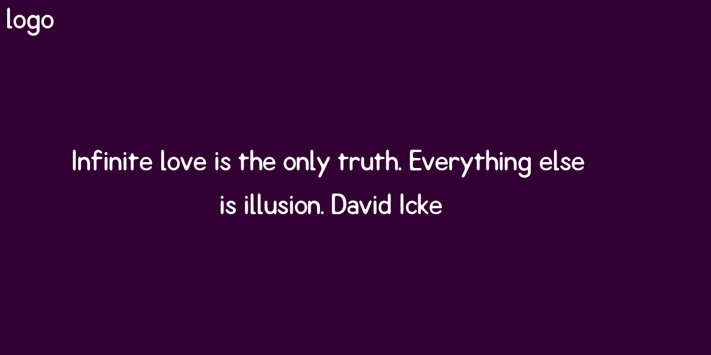

# Quote Maker

Just another python script to automate boring stuff. Quote maker easy to create a quoted image and publish to a Facebook page. 

#### Depended Python libs

- textwrap
- PIL

Install by "pip3 install --upgrade -r requirements.txt"

#### Depended libs

    * curl 7.52.1 (x86_64-pc-linux-gnu) 
    * libcurl/7.52.1 
    * OpenSSL/1.0.2l 
    * zlib/1.2.8

### Run

run the script by 

    $:python3.6 main.py
    ****************************************************************************************
    ​~~~ quote_maker.py ~~~
    quote: Infinite love is the only truth. Everything else is illusion. David Icke

### Output

### Post to Facebook

To enable access of Facebook to publish, following variable has to be hardcoded to achieve. 

`page_id`  - facebook page ID, information can obtain from the page about. if you want to post on the personal wall 

just hardcode `page_id` = "me".

`facebook_token` - facebook access token with publish_action enable. for more visit

 Graph API explorer: https://developers.facebook.com/tools/explorer/145634995501895/

### How to change image size?

`image_size_x` `image_size_y` responcible for image size.

###### Note: background colour is random, but the fourground colour is always white. 

